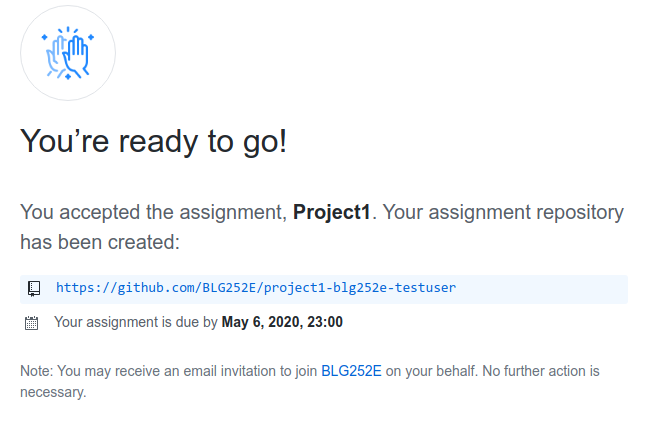
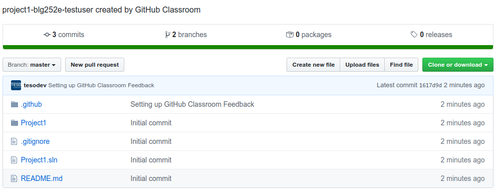

# Project 1 Submission

First, go to [this link](https://classroom.github.com/a/ZD7uTKpl), and accept the assignment. This will automatically create a repository for you, with an example project structure inside. After accepting, you will see the following screen:



Click on the repository link, and you should now see your newly created repository.



Click on the **Clone or download** button, and copy the url for your repository (or you can copy the url of the repository page).

Now open **Git Bash** (on Windows) or your terminal (on Linux or macOS), and type the following command:

```bash
git clone https://github.com/BLG252E/project1-your-github-username.git
```

Now your repository is cloned to your computer inside the `project1-your-github-username` folder.

If you are using Git Bash and have not chaned the directory, it should be by default under your User directory (`C:\Users\username`). You can open the solution with Visual Studio, or copy files, or edit them however you like until you have finished your project. After you are done, now you need to commit your changes and upload them to Github. Open Git Bash again, and type the following commands:

```bash
cd project1-your-github-username
git add -A
git commit -m "Enter your commit message here"
git push
```

If this is the first time you are committing something to git, you will get an error like the following:

```bash
Please tell me who you are.

Run
    git config --global user.email "you@example.com"
    git config --global user.name "Your Name"
```

As the error message suggests, run these commands and replace your Github username and the email address you have signed up to Github with. After that, you can try committing again, which should now work if you have done everything correctly.