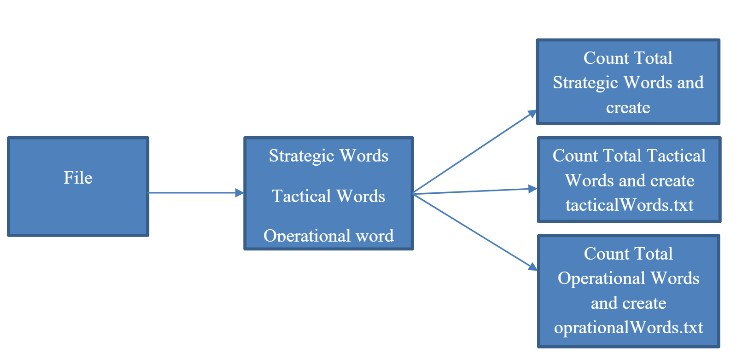

# 2015 - 2016 Midterm

Total points: 150

## Question 1 (50 pts)

The literature emphasizes that decisions within an organization have strategic, tactical, and operational levels. Bag of words for each level is given below:

| Strategic Level | Tactical Level | Operational Level |
|:---------------:|:--------------:|:-----------------:|
| Development     | Process        | Number            |
| Improvement     | Excellence     | Waiting           |
| Culture         | Satisfaction   | Time              |
|                 |                | Total             |
|                 |                | Income            |



Using the words from [words.txt](./words.txt), write a C# program as illustrated above.

Sample output files

```
Total strategic words: 45
Total tactical words: 65
Total operational words: 49 
```

## Question 2 (25 pts)

There is information about several books in the [given file](./library.txt). We expect you to read the file, and within the information provided by the user it is expected that you perform sorting and filtering operations. With your sorting and filtering operations, you should end up with the books that the user demands. One of the most significant operations that we expect you to do is to scan the library with the book code provided by the user. If the book exists, you should show details regarding to that specific book on the screen. If the book is not in the library, you should give a warning message.

## Question 3 (25 pts)

[The list provided](./flightplan.txt) contains the flight schedule between 12-04-2016 and 26-04-2016. The lines in this list consist of **Flight number**, **departure point**, **arrival point**, **flight date**, **ticket price**, **quota**. Using the information in the list, we expect you to:

* Filter and find tickets with only departure point provided, only arrival point provided, or both points provided by the user.
* Filter and find tickets within a specific flight date range provided by the user (Note: you should sort your results according to ascending ticket price).
* Filter and find tickets with ticket price provided by the user

You can combine your filtering operations regarding to the user's demands (e.g. Izmir - Istanbul flights between 15-04-2016 and 20-04-2016). You should show resulting tickets on the screen after your operations.

If the user wants to buy a ticket, you should generate a pin number. Pin number consists of first 3 letter of the departure point + first 3 letters of the arrival point + time and date of the ticket generation without any spaces between (e.g. IZMIST20160420154543001). (Note: `DateTime` method gives you `dd.MM.yyy HH:mm:ss.fff`).

When you are selling a ticket, you should ask the user for a name, surname and quantity of tickets. With this information, you should generate a record in a log file. A row in this log file must look like: `Flight Number – Name – Surname – Quantity of Tickets – Total Cost –
DateTime`.

***Note***: Do not forget to update the quota after selling a ticket.

## Question 4 (50 pts)

A company needs a software; software requirements are specified as:

* To be able to see ongoing project names, since what date the ongoing projects are active
* To be able to create a new project and assign employees
* To be able to see developer list in the company (name -- surname -- department)
Note: Departments such as: Mobile, Database Management, Web App Developer, etc.
* To be able to see detailed information about developers by providing a name (you can create your own filters, e.g. ID)
Note: The result: "name + surname + department + previous projects + ongoing projects + rank". Ranks are 1 to 5.
* To be able to hire new employees and fire employees.
* In case of firing an employee, that employee's ongoing projects will be distributed among other employees working in the same department.

**Note**: Every rank has +2 ongoing projects. For example: rank 1 can only have 2 ongoing projects, whereas rank 3 can have 6 ongoing projects.

**Note**: In case of firing an employee, if every developer in that particular department is working at full capacity (if fired employee's ongoing projects cannot be distributed), a warning message will be shown on the screen and ask for approval of firing. If approved, fired employee's ongoing projects will be frozen. If company hires new employees (or if developers in the same department finish their own projects), fired employee's projects will be assigned to developers from oldest project activated to newest project activated.

**Note**: Do not forget to create necessary files in order for project to run properly. For example: employee file.
